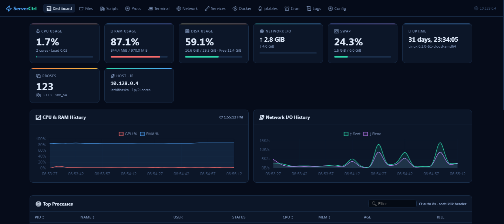
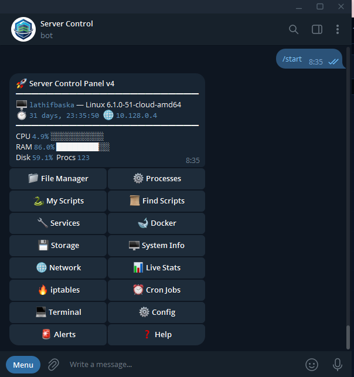
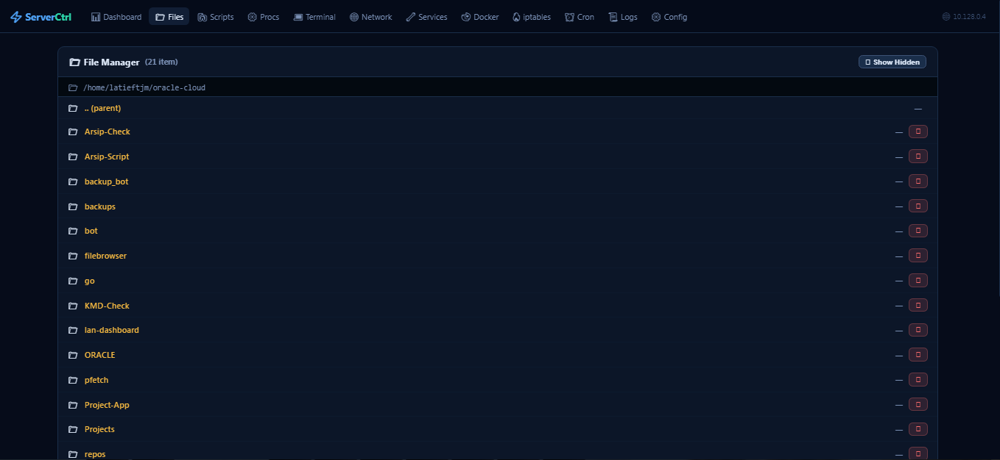
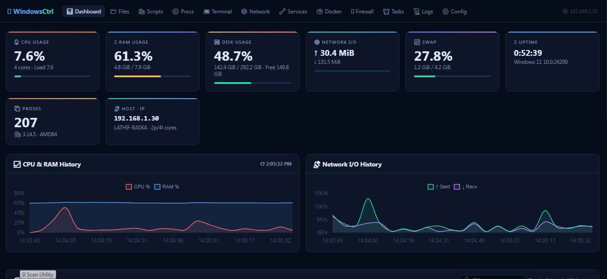
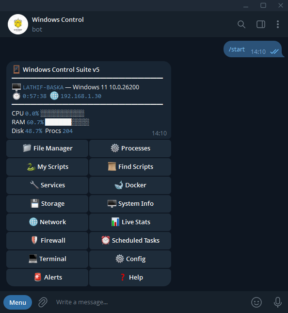
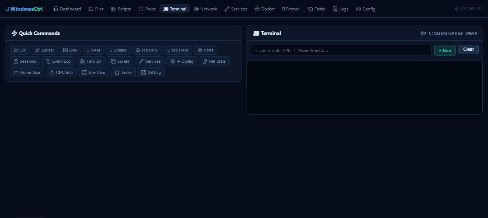
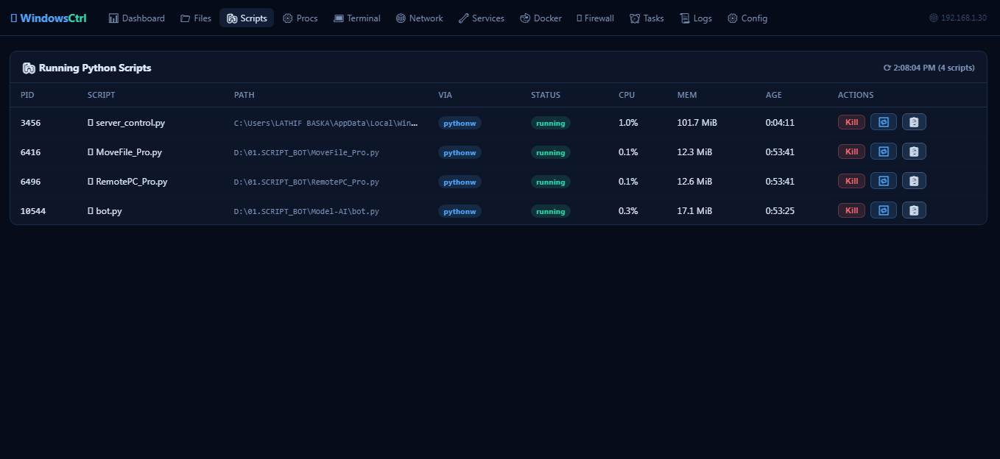

# Server Control Suite

<p align="center">
  <strong>Remote management server dan PC melalui Telegram Bot + Web Dashboard.</strong>
</p>

<p align="center">
  
  
  
  
</p>

<p align="center">
  <a href="./README.md">English</a>
  ·
  <a href="./docs/INSTALL_LINUX.md">Instalasi Linux</a>
  ·
  <a href="./docs/INSTALL_WINDOWS.md">Instalasi Windows</a>
  ·
  <a href="./SECURITY.md">Security</a>
</p>

<p align="center">
  <a href="https://github.com/baska-pro/server-control-suite/releases/tag/linux-v4.0.0">
    
  </a>
  <a href="https://github.com/baska-pro/server-control-suite/releases/tag/windows-v5.0.0">
    
  </a>
</p>

---

## Tentang Project

**Server Control Suite** berisi dua aplikasi remote administration single-file:

| Platform | File | Versi | Runtime |
|---|---|---:|---|
| Linux | `server_control_linux.py` | 4.0.0 | Python 3.8+ |
| Windows | `server_control_win.py` | 5.0.0 | Python 3.10+ |

Keduanya menggabungkan Telegram Bot privat dan dashboard web untuk monitoring serta administrasi komputer/server.

### Fitur utama

- monitoring CPU, RAM, disk, network, uptime, dan proses;
- File Manager;
- upload/download dan edit file;
- pengelolaan proses;
- pencarian dan menjalankan script;
- Web Terminal;
- Docker;
- alert CPU/RAM/Disk ke Telegram;
- dashboard web responsive;
- pembatasan Telegram berdasarkan Owner/Admin ID.

### Linux

- `systemctl` Services;
- journal/syslog/auth/dmesg;
- iptables;
- cron;
- nohup runner;
- network/storage tools;
- cocok untuk VPS/server Linux termasuk penggunaan Oracle Cloud.

### Windows

- Windows Services;
- Event Viewer;
- Windows Defender Firewall;
- Scheduled Tasks;
- startup otomatis melalui Task Scheduler;
- proses background melalui `pythonw.exe`;
- shortcut Dashboard pada Desktop/Start Menu;
- Waitress web server;
- single-instance protection.

> [!IMPORTANT]
> Project ini memiliki kemampuan administrasi yang sangat tinggi, termasuk menjalankan command, mengubah file, menghentikan proses, mengontrol service, firewall, dan scheduled task. Jangan membuka dashboard langsung ke Internet publik tanpa lapisan keamanan tambahan.

## Download / Clone dari GitHub

### Cara 1 — Clone dengan Git

```bash
git clone https://github.com/baska-pro/server-control-suite.git
cd server-control-suite
```

Update berikutnya:

```bash
git pull
```

### Cara 2 — Download ZIP

Pada halaman repository:

```text
Code → Download ZIP
```

Extract ZIP, lalu pilih file sesuai sistem operasi.

### Cara 3 — GitHub Release

Release Linux dan Windows sudah tersedia. Download file sesuai platform yang diperlukan:

```text
server_control_linux.py
server_control_win.py
```

## Instalasi Cepat Linux

```bash
git clone https://github.com/baska-pro/server-control-suite.git
cd server-control-suite

python3 -m venv .venv
source .venv/bin/activate
pip install -r requirements-linux.txt

cp .env.example .env
nano .env
```

Isi minimal:

```text
TOKEN_SERVER_CONTROL=TOKEN_BOT_TELEGRAM
ADMIN_ID=ID_TELEGRAM_ANDA
```

Kemudian:

```bash
set -a
source .env
set +a

python3 server_control_linux.py
```

Untuk menjalankan otomatis sebagai service:

[docs/INSTALL_LINUX.md](./docs/INSTALL_LINUX.md)

## Instalasi Cepat Windows

Persyaratan:

```text
Windows 10 / 11
Python 3.10+
Internet untuk instalasi dependency pertama
```

Buka PowerShell/Terminal sebagai Administrator:

```powershell
py server_control_win.py
```

Saat pertama kali dijalankan, script Windows akan:

1. meminta elevasi Administrator;
2. meminta Telegram Bot Token;
3. meminta Telegram Owner/Admin ID;
4. meminta port dashboard;
5. menyimpan konfigurasi ke folder aplikasi user;
6. membuat copy aplikasi stabil;
7. memasang Task Scheduler agar aktif saat login;
8. membuat shortcut Dashboard;
9. menambahkan rule Windows Defender Firewall private jika Administrator;
10. menjalankan aplikasi di background tanpa terminal.

Panduan lengkap:

[docs/INSTALL_WINDOWS.md](./docs/INSTALL_WINDOWS.md)

## Dashboard

Default:

```text
Port: 8080

http://127.0.0.1:8080
http://IP-KOMPUTER:8080
```

Dashboard menggunakan login token.

## Security

Untuk penggunaan nyata:

- gunakan `DASH_TOKEN` acak dan panjang;
- gunakan `DASH_SECRET` terpisah dan panjang;
- jangan pernah commit Bot Token;
- jangan commit file `.env`;
- lebih aman menggunakan VPN/Tailscale/WireGuard atau Access Proxy;
- batasi firewall hanya ke jaringan/IP terpercaya;
- gunakan HTTPS jika dashboard diakses melewati jaringan yang tidak dipercaya.

Baca:

[SECURITY_HARDENING.md](./docs/SECURITY_HARDENING.md)

## Konfigurasi

| Setting | Linux | Windows | Fungsi |
|---|---:|---:|---|
| `TOKEN_SERVER_CONTROL` | Wajib | Bisa override | Telegram Bot Token |
| `ADMIN_ID` | Wajib | Bisa override | Telegram Owner ID |
| `DASH_PORT` | Opsional | Opsional | Port dashboard |
| `DASH_SECRET` | Disarankan | Opsional override | Flask session secret |
| `DASH_TOKEN` | Disarankan | Opsional override | Token login web |
| `ALERT_CPU` | Opsional | Opsional | Threshold CPU |
| `ALERT_RAM` | Opsional | Opsional | Threshold RAM |
| `ALERT_DISK` | Opsional | Opsional | Threshold disk |
| `ALERT_CD` | Opsional | Opsional | Cooldown alert |

## Update

Jika menggunakan clone Git:

```bash
git pull
```

### Linux

```bash
sudo systemctl restart server-control
```

atau jika dijalankan manual, stop proses lalu jalankan kembali.

### Windows

Jalankan file `server_control_win.py` terbaru secara normal. Script akan memperbarui installed copy jika source berubah, lalu background process dapat direstart.

Panduan lengkap:

[docs/UPDATE.md](./docs/UPDATE.md)

## Screenshot

### Linux

<p align="center">
  
</p>

<table>
  <tr>
    <td width="50%" align="center">
      <br>
      <strong>Kontrol Telegram</strong>
    </td>
    <td width="50%" align="center">
      <br>
      <strong>File Manager</strong>
    </td>
  </tr>
</table>

### Windows

<p align="center">
  
</p>

<table>
  <tr>
    <td width="50%" align="center">
      <br>
      <strong>Kontrol Telegram</strong>
    </td>
    <td width="50%" align="center">
      <br>
      <strong>Web Terminal</strong>
    </td>
  </tr>
  <tr>
    <td colspan="2" align="center">
      <br>
      <strong>Manajemen Script</strong>
    </td>
  </tr>
</table>

Screenshot lainnya tersedia di [`assets/screenshots/`](./assets/screenshots/).

## Versi

```text
Linux   : 4.0.0
Windows : 5.0.0
```

Gunakan tag release per platform:

```text
linux-v4.0.0
windows-v5.0.0
```

## Lisensi

Copyright © 2026 Lathif Baska.

Repository menggunakan lisensi **All Rights Reserved / source-available**. Lihat [LICENSE](./LICENSE).

## Pengembang

**Lathif Baska**

GitHub: [@baska-pro](https://github.com/baska-pro)
